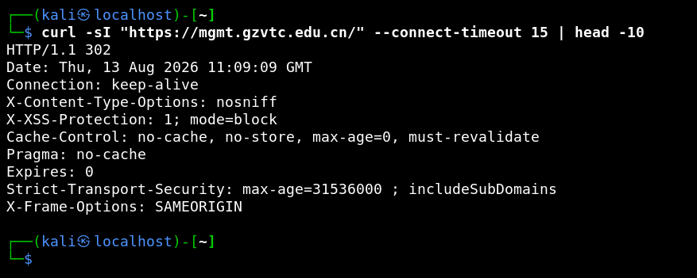

# terminal-kali

> AI 渗透复现时，还原真实的 Kali 终端图片。



渗透测试中提交漏洞复现截图，手工伪造一眼假、渲染图不像真终端。本插件让 AI 在复现漏洞时自动生成**像素级真实的 Kali 终端截图**：复现模式下的每条命令，都会生成 txt 原文 + 还原度极高的 Kali 终端 PNG。

## 功能

- **真实终端渲染**：WSL kali 内 Xvfb + xterm 无头渲染，非手绘"假终端"
- **Kali zsh 提示符**：`┌──(kali㉿localhost)-[~]` / `└─$` 双行格式，与真人操作一致
- **精确配色**：结构符号绿 `#00CC00`、用户名/主机名/`$` 蓝 `#4D94FF`、路径白
- **自动归档**：txt + png 成对写入 `02_复现证据\V<编号>_<简述>\`
- **无痕运行**：脚本复制到 kali 家目录执行，无 WSL 路径泄露；截图前隐藏光标

## 安装

1. 复制 `plugin/`、`scripts/`、`command/` 到 `~/.config/opencode/`
2. （可选）复制 `skills/` 到 `~/.config/opencode/`
3. 重启 opencode

依赖：WSL kali-linux，安装 `xvfb xterm imagemagick fonts-droid-fallback`。

## 使用

1. 从项目目录启动：`I:\渗透日志和复现\<项目名>`（`PENTEST_ROOT` 可覆盖）
2. 进入复现模式：说"复现"、发 `/repro <编号> [简述]`，或调用 `start_repro` 工具
3. 之后的每条 bash 命令自动生成真实终端截图：

```
02_复现证据\V01_未授权访问_webapi\
  001_2026-08-11_213000_curl.txt
  001_2026-08-11_213000_curl.png
  请求包_1_getUserInformation.txt
  manifest.md
```

4. 切回探测：`/probe` 或 `start_probe`

## 文件结构

```
├── plugin/pentest-evidence.ts   # 插件主逻辑
├── scripts/term-shot.ps1        # Windows 侧引擎入口
├── scripts/term-shot.sh         # WSL 侧 Xvfb+xterm 渲染引擎
├── command/repro.md, probe.md   # 复现/探测模式命令
└── skills/web-pentest/SKILL.md  # 渗透方法论
```
